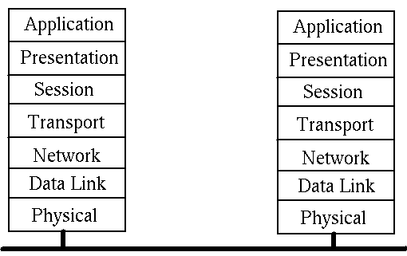
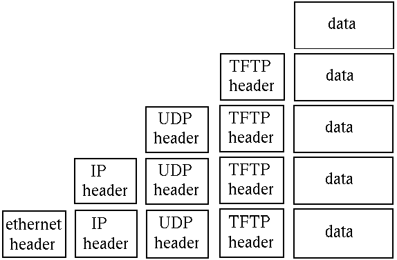
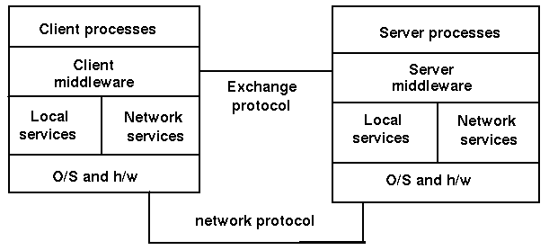

Architecture
==============

    This chapter covers the major architectural features of distributed sytems.
    

Introduction
--------------

You can't build a system without some idea of what you want to build. And you can't build it if you don't know the environment in which it will work. GUI programs are different to batch processing programs; games programs are different to business programs; and distributed programs are different to standalone programs. They each have their approaches, their common patterns, the problems that typically arise and the solutions that are often used.

This chapter covers the highl evel architectural aspects of distributed systems. There are many ways of looking at such systems, and many of these are dealt with.

Protocol Layers
----------------

Distributed systems are hard. There are multiple computers involved, which have to be connected in some way. Programs have to be written to run on each computer in the system and they all have to co-operate to get a distributed task done.

The common way to deal with complexity is to break it down into smaller and simpler parts. These parts have their own structure, but they also have defined means of communicating with other related parts. In distributed systems, the parts are called protocol layers and they have clearly defined functions. They form a stack, with each layer communicating with the layer above and the layer below. The communication between layers is defined by protocols.

Network communications requires protocols to cover high-level application communication all the way down to wire communication and the complexity handled by encapsulation in protocol layers.

ISO OSI Protocol
~~~~~~~~~~~~~~~~~~

Although it was never properly implemented, the OSI (Open Systems Interconnect) protocol has been a major influence in ways of talking about and influencing distributed systems design. It is commonly given in the following figure: 

OSI layers
~~~~~~~~~~~~~~~

The function of each layer is:

- Network layer provides switching and routing technologies
- Transport layer provides transparent transfer of data between end systems and is responsible for end-to-end error recovery and flow control
- Session layer establishes, manages and terminates connections between applications.
- Presentation layer provides independance from differences in data representation (e.g. encryption)
- Application layer supports application and end-user processes

TCP/IP Protocol
~~~~~~~~~~~~~~~~~

While the OSI model was being argued, debated, partly implemented and fought over, the DARPA internet research project was busy building the TCP/IP protocols. These have been immensely succesful and have led to The Internet (with capitals). This is a much simpler stack:

.. image:: _static/img/tcp_stack.gif 

Some Alternative Protocols
~~~~~~~~~~~~~~~~~~~~~~~~~~~

Although it almost seems like it, the TCP/IP protocols are not the only ones in existence and in the long run may not even be the most successful. There are many protocols occupying significant niches, such as

- Firewire
- USB
- Bluetooth
- WiFi

Thre is active work continuing on many other protocols, even quite bizarre ones such as those for the "internet in space."

The focus in this book will be on the TCP/IP, but you should be aware of these other ones.

Networking
------------

A network is a communications system for connecting end systems called hosts. The mechanisms of connection might be copper wire, ethernet, fibre optic or wireless, but that won't concern us here. A local area network (LAN) connects computers that are close together, typically belonging to a home, small organisation or part of a larger organisation.

A Wide Area Network (WAN) connects computers across a larger physical area, such as between cities. There are other types as well, such as MANs (Metropolitan Area Network), PANs (Personal Are Networks) and even BANs (Body Are Network).

An internet is a connection of two or more distinct networks, typically LANs or WANs. An intranet is an internet with all networks belonging to a single organisation.

There are significant differences between an internet and an intranet. Typically an intranet will be under a single administrative control, which will impose a single set of coherent policies. An internet on the other hand will not be under the control of a single body, and the controls exercised over different parts may not even be compatable.

A trivial example of such differences is that an intranet will often be restricted to computers by a small number of vendors running a standardised version of a particular operating system. On the other hand, an internet will often have a smorgasborg of different computers and operating systems.

The techniques of this book will be applicable to internets. They will also be valid for intranets, but there you will also find specialised, non-portable systems.

And then there is the "mother" of all internets: The Internet. This is just a very, very large internet that connects us to Google, my computer to your computer and so on.

Gateways
---------

A gateway is a generic term for an entity used to connect two or more networks. A repeater operates at the physical level copies the information from one subnet to another. A bridge operates at the data link layer level and copies frames between networks. A router operates at the network level and not only moves information between networks but also decides on the route.

Packet encapsulation
---------------------

The communication between layers in either the OSI or the TCP/IP stacks is done by sending packets of data from one layer to the next, and then eventually across the network. Each layer has administrative information that it has to keep about its own layer. It does this by adding header information to the packet it receives from the layer above, as the packet passes down. On the receiving side, these headers are removed as the packet moves up.

For example, the TFP (Trivial File Transfer Protocol) moves files from one computer to another. It uses the UDP protocol on top of the IP protocol, which may be sent over Ethernet. This looks like: 

The packet transmitted over ethernet, is of course the bottom one.

Connection Models
------------------

In order for two computers to communicate, they must set up a path whereby they can send at least one message in a session. There are two major models for this:

- Connection oriented
- Connectionless

Connection oriented
~~~~~~~~~~~~~~~~~~~~~~

A single connection is established for the session. Two-way communications flow along the connection. When the session is over, the connection is broken. The analogy is to a phone conversation. An example is TCP

Connectionless
~~~~~~~~~~~~~~~

In a connectionless system, messages are sent independant of each other. Ordinary mail is the analogy. Connectionless messages may arrive out of order. An example is the IP protocol. Connection oriented transports may be established on top of connectionless ones - TCP over IP. Connectionless transports my be established on top of connection oriented ones - HTTP over TCP.

There can be variations on these. For example, a session might enforce messages arriving, but might not guarantee that they arrive in the order sent. However, these two are the most common.

Communications Models
----------------------

Message passing
~~~~~~~~~~~~~~~~

Some non-procedural languages are built on the principle of message passing. Concurrent languages often use such a mechanism, and the most well known example is probably the Unix pipeline. The Unix pipeline is a pipeline of bytes, but there is not an inherent limitation: Microsoft's PowerShell can send objects along its pipelines, and concurrent languages such as Parlog could send arbitrary logic data structures in messages between concurrent processes.

Message passing is a primitive mechanism for distributed systems. Set up a connection and pump some data down it. At the other end, figure out what the message was and respond to it, possibly sending messages back. This is illustrated by 

.. image:: _static/img/msg.gif 

Low level event driven systems such as the X Window System function in a somewhat similar way: wait for message from a user (mouse clicks, etc), decode them and act on them.

Higher level event driven systems assume that this decoding has been done by the underlying system and the event is then dispatched to an appropriate object such as a ButtonPress handler. This can also be done in distributed message passing systems, whereby a message received across the network is partly decoded and dispatched to an appropriate handler.

Remote procedure call
~~~~~~~~~~~~~~~~~~~~~~

In any system, there is a transfer of information and flow control from one part of the system to another. In procedural languages this may consist of the procedure call, where information is placed on a call stack and then control flow is transferred to another part of the program.

Even with procedure calls, there are variations. The code may be statically linked so that control transfers from one part of the program's executable code to another part. Due to the increasing use of library routines, it has become commonplace to have such code in dynamic link libraries (DLLs), where control transfers to an independent piece of code.

DLLs run in the same machine as the calling code. it is a simple (conceptual) step to transfer control to a procedure running in a different machine. The mechanics of this are not so simple! However, this model of control has given rise to the "remote procedure call" (RPC) which is discussed in much detail in a later chapter. This is illustrated by 

.. image:: _static/img/rpc.gif

There is an historical oddity called the "lightweight remote procedure call" invented by Microsoft as they transitioned from 16-bit to 32-bit applications. A 16-bit application might need to transfer data to a 32-bit application on the same machine. That made it lightweight as there was no networking! But it had many of the other issues of RPC systems in data representations and conversion.

Distributed Computing Models
------------------------------

At the highest lvel, we could consider the equivalence or the non-equivalence of components of a distributed system. The most common occurrence is an asymmetric one: a client sends requests to a server, and the server responds. This is a client-server system.

If both components are equivalent, both able to initiate and to respond to messages, then we have a peer-to-peer system. Note that this is a logical classification: one peer may be a 16,000 core mainframe, the other might be a mobile phone. But if both can act similarlym then they are peers.

A third model is the so-called filter. Here one component passes information to another which modifies it before passing it to a third. This is a fairly common model: for example, the middle component gets information from a database as SQl records and transforms it into an HTML table for the third component (which might be a browser).

These are illustrated as: 

Client/Server System
-----------------------

Another view of a client server system is

.. image:: _static/img/cs-system.gif

Client/Server Application
----------------------------

And a third view is 

.. image:: _static/img/cs-application.gif

Server Distribution
-----------------------

A client-server systems need not be simple. The basic model is single client, single server 

but you can also have multiple clients, single server 

.. image:: _static/img/many-one.gif

In this, the master receives requests and instead of handling them one at a time itself, passes them off to other servers to handle. This is a common model when concurrent clients are possible.

There are also single client, multiple servers 

.. image:: _static/img/one-many.gif

which occurs frequently when a server needs to act as a client to other servers, such as a business logic server getting information from a database server. And of course, there could be multiple clients with multiple servers.

Component Distribution
-------------------------

A simple but effective way of decomposing many applications is to consider them as made up of three parts:

- Presentation component
- Application logic
- Data access

The presentation component is responsible for interactions with the user, both displaying data and gathering input. it may be a modern GUI interface with buttons, lists, menus, etc, or an older command-line style interface, asking questions and getting answers. The details are not important at this level.

The application logic is responsible for intrepreting the users' responses, for applying business rules, for preparing queries and managing responses from the thir component.

The data access component is responsible for stroing and retrieving data. This will often be through a database, but not necessarily.

Gartner Classification
~~~~~~~~~~~~~~~~~~~~~~~~

Based on this threefold decomposition of applicaitons, Gartner considered how the components might be distributed in a client-server sysem. They came up with five models: 

.. image:: _static/img/gartner.gif

Example: Distributed Database
~~~~~~~~~~~~~~~~~~~~~~~~~~~~~~

- Gartner classification: 1

Modern mobile phones make good examples of this: due to limited memory they may store a small part of a database locally so that they can usuall respond quickly. However, if data is required that is not held locally, then a request may be made to a remote database for that additional data.

Google maps forms another good example. Al of the maps reside on Google's servers. When one is requested by a user, the "nearby" maps are also downloaded into a small database in the browser. When the user moves the map a little bit, the extra bits required are already in the local store for quick response.

Example: Network File Service
~~~~~~~~~~~~~~~~~~~~~~~~~~~~~~

Gartner classification 2 allows remote clients acess to a shared file system 

There are many examples of scuh systems: NFS, Microsoft shares, DCE, etc

Example: Web
~~~~~~~~~~~~~~

An example of Gartner classification 3 is the Web with Java applets. This is a distributed hypertext system, with many additional mechanisms 

.. image:: _static/img/gartner3.gif

Example: Terminal Emulation
~~~~~~~~~~~~~~~~~~~~~~~~~~~~~

An example of Gartner classification 4 is terminal emulation. This allows a remote system to act as a normal terminal on a local system. 

Telnet is the most common example of this.

Example: Expect
~~~~~~~~~~~~~~~~

Expect is a novel illustration of Gartner classification 5. It acts as a wrapper around a classical system such as a command-line interface. It builds an X Window interface around this, so that the user interacts with a GUI, and the GUI in turn interacts with the command-line interface

Example: X Window System
~~~~~~~~~~~~~~~~~~~~~~~~~~

The X Window System itself is an example of Gartner classification 5. An application makes GUI calls such as DrawLine, but these are not handled directly but instead passed to an X Window server for rendering. This decouples the application view of windowing and the display view of windowing. 

Three Tier Models
~~~~~~~~~~~~~~~~~~~

of course, if you have two tiers, then you can have three, four, or more. Some of the three tier possibilities are shown in this diagram: 

.. image:: _static/img/threetier.gif

The modern Web is a good example of the rightmost of these. The backend is made up of a database, often running stored procedures to hold some of the database logic. The middle tier is an HTTP server such as Apache running PHP scripts (or Ruby on Rails, or JSP pages, etc). This will manage some of the logic and will have data such as HTML pages stored locally. The frontend is a browser to display the pages, under the control of some Javascript. In HTML 5, the frontend may also have a local database.

Fat vs thin
~~~~~~~~~~~~~~

A common labelling of components is "fat" or "thin". Fat components take up lots of memory and do complex processing. Thin components on the other hand, do little of either. There don't seem to be any "normal" size components, only fat or thin!

Fatness or thinness is a relative concept. Browsers are often laelled as thin because "all they do is diplay web pages". Firefox on my Linux box takes nearly 1/2 a gigabyte of memory, which I don't regard as small at all!

Middleware model
-----------------

Middleware is teh "glue" connecting components of a distributed system. The middleware model is 

Middleware
-----------

Components of middleware include

- The network services include things like TCP/IP
- The middleware layer is application-independent s/w using the network services
- Examples of middleware are: DCE, RPC, Corba
- Middleware may only perform one function (such as RPC) or many (such as DCE)

Middleware examples
~~~~~~~~~~~~~~~~~~~~~~

Examples of middleware include

- Primitive services such as terminal emulators, file transfer, email
- Basic services such as RPC
- Integrated services such as DCE, Network O/S
- Distributed object services such as CORBA, OLE/ActiveX
- Mobile object services such as RMI, Jini
- World Wide Web

Middleware functions
~~~~~~~~~~~~~~~~~~~~~

The functions of middleware include

- Initiation of processes at different computers
- Session management
- Directory services to allow clients to locate servers
- remote data access
- Concurrency control to allow servers to handle multiple clients
- Security and integrity
- Monitoring
- Termination of processes both local and remote

Continuum of Processing
-------------------------

The Gartner model is based on a breakdown of an application into the components of presentation, application logic and data handling. A finer grained breakdown is 

.. image:: _static/img/continuum.gif

Points of Failure
------------------

Distributed applications run in a complex environment. This makes them much more prone to failure than standalone applications on a single computer. The points of failure include

- The client side of the application could crash
- The client system may have h/w problems
- The client's network card could fail
- Network contention could cause timeouts
- There may be network address conflicts
- Network elements such as routers could fail
- Transmission errors may lose messages
- The client and server versions may be incompatable
- The server's network card could fail
- The server system may have h/w problems
- The server s/w may crash
- The server's database may become corrupted

Applications have to be designed with these possible failures in mind. Any action performed by one component must be recoverable if failure occurs in some other part of the system. Techniques such as transactions and continuous error checking need to be employed to avoid errors.

Acceptance Factors
--------------------

- Reliability
- Performance
- Responsiveness
- Scalability
- Capacity
- Security

Transparency
---------------

The "holy grails" of distributed systems are to provide the following:

- access transparency
- location transparency
- migration transparency
- replication transparency
- concurrency transparency
- scalability transparency
- performance transparency
- failure transparency

Eight fallacies of distributed computing
---------------------------------------------

Sun Microsystems was a company that performed much of the early work in distributed systems, and even had a mantra "The network is the computer." Based on their experience over many years a number of the scientists at Sun came up with the following list of fallacies commonly assumed:

#. The network is reliable.
#. Latency is zero.
#. Bandwidth is infinite.
#. The network is secure.
#. Topology doesn't change.
#. There is one administrator.
#. Transport cost is zero.
#. The network is homogeneous.

Many of these directly impact on network programming. For example, the design of most remote procedure call systems is based on the premise that the network is reliable so that a remote procedure call will behave in the same way as a local call. The fallacies of zero latency and infinite bandwidth also lead to assumptions about the time duration of an RPC call being the same as a local call, whereas they are magnitudes of order slower.

The recognition of these fallacies led Java's RMI (remote method invocation) model to require every RPC call to potentially throw a RemoteException. This forced programmers to at least recognise the possibility of network error and to remind them that they could not expect the same speeds as local calls.
