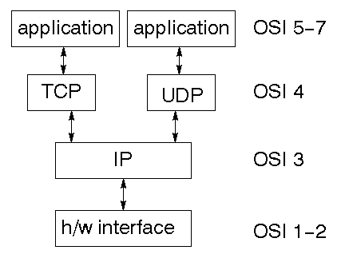
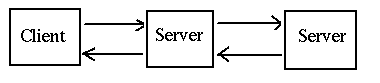

架构
==============

    本章涵盖了分布式系统架构的主要特性。
    

前言
--------------

你若不知道你想构建什么，就无法构建一个系统。而如果你不知道它会在何种环境下工作，也同样不行。就像GUI程序不同于批处理程序，游戏程序不同于商业程序一样，分布式程序也不同于独立的程序。它们都有各自的方法，常见的模式，经常出现的问题以及常用的解决方案。

本章涵盖了分布式系统的上层架构，从多种角度考虑了这样的系统及其依赖。

协议层
----------------

分布式系统很复杂，它涉及到多台计算机的连接方式。我们编写的程序必须能在该系统中的每一台计算机上运行，它们必须都能协同操作来完成一项分布式任务。

解决这种复杂性的一般方法，就是将它分解为更小更简单的部分。这些部分都有它们自己的结构，但也定义了与其它相关部分进行通信的方式。在分布式系统中，这种部分称为协议层，它们的功能都有明确的定义。它们在一起形成层次结构，并与其各自的上下层进行通行。层次之间的通信则由协议来定义。

网络通信所需的协议覆盖了从上层应用通信一直到底层有线通信的所有方式，它们的复杂性通过在协议层中进行封装来处理。

ISO OSI 协议
~~~~~~~~~~~~~~~~~~

尽管OSI（开放系统互联）协议从未被完整地实现过，但它仍对分布式系统的讨论和设计产生了十分重要的影响。它的结构大致为下图所示：

.. image:: _static/img/iso.gif

OSI 层
~~~~~~~~~~~~~~~

每一层的功能为：

- 网络层提供交换和路由技术
- 传输层在终端系统间提供透明的数据传输，并负责端对端的错误恢复及流程控制
- 会话层在应用间建立、管理并结束连接
- 表现层提供数据表现差异的独立性（例如加密）
- 应用层支持应用与最终用户的处理

TCP/IP 协议
~~~~~~~~~~~~~~~~~

当OSI标准模型正在为实现细节闹得不可开交时，DARPA互联网技术项目却在忙着构建TCP/IP协议。它们取得了极大的成功，并引领了Internet（首字母大写），因为这是个更简单的层次结构：

一些可选的协议
~~~~~~~~~~~~~~~~~~~~~~~~~~~

尽管现在到处都是TCP/IP协议，但它并不是唯一存在的。从长远来看，它甚至不会是最成功的。还有些协议占有重要的地位，比如：

- 火线
- USB
- 蓝牙
- WiFi

还有些其它的协议在继续活跃地工作，甚至还有些像“太空互联网”这样奇怪的协议。

本书将重点介绍TCP/IP，但你也应当了解一些其它的协议。

网络
------------

网络是一个通信系统，它连接了称为主机的最终系统。这种连接机制可以是铜线、以太网、光纤或无线，但这些与我们无关。局域网（LAN）将计算机紧密地连接在一起，一般为家庭、小型组织或大型组织的一部分。

广域网（WAN）连接起一个更大物理区域的计算机，例如城际间。还有些其它的类型，如城域网（MAN）、个人域网（PAN）甚至人体域网（BAN）。

互联网是多个不同网络的连接，一般为LAN或WAN。内联网是属于某个组织的所有网络加上互联网。

互联网与内联网之间有明显的不同。一般来说，一个内联网处在单一的管控之下，它将被应用一组统一的策略。另一方面，一个互联网则不会在单一主体的控制之下，控制的不同部分甚至可能会不兼容。

这种不同的一个例子，就是一个内联网通常被少量供应商提供的，运行着特定操作系统标准化版本的计算机所限制。另一方面，一个互联网通常有各种各样的计算机和操作系统。

本书中的技术可应用于互联网。它们对内联网也是有效的，但你也会发现一些专有的，不可移植的系统。

所有互联网都有一个“母网”：因特网。它其实就是个非常巨大的互联网，它将我们与Google、我们的计算机等等互相连接起来。

网关
---------

网关是一个统称，它用于连接起一个或多个网络。其中的中继器在物理层面上进行操作，它将信息从一个子网复制到另一个子网上。桥接在数据连接层面上进行操作，它在网络之间复制帧。路由器在网络层面上进行操作，它不仅在网络之间复制信息，还决定了信息的传输路线。

数据包封装
---------------------

在OIS或TCP/IP协议栈层与层之间的通信，是通过将数据包从一个层发送到下一个层，最终穿过整个网络的。每一层都有必须保持其自身层的管理信息。从上层接收到的数据包在向下传递时，会添加头信息。在接收端，这些头信息会在向上传递时移除。

例如，TFTP（普通文件传输协议）将文件从一台计算机移动到另一台上。它使用IP协议上的UDP协议，该协议可通过以太网发送。看起来就像这样：

.. image:: _static/img/packets.gif 

通过以太网发送的数据包，当然是底部那个。

连接模型
------------------

为了两个计算机进行通信，就必须建立一个路径，使他们能够在一个会话中发送至少一条消息。有两个主要的模型：

- 面向连接模型
- 无连接模型

面向连接模型
~~~~~~~~~~~~~~~~~~~~~~

即为会话建立单个连接，沿着连接进行双向通信。当会话结束后，该连接就会断开。这类似于电话交谈。例子就是TCP。

无连接模型
~~~~~~~~~~~~~~~

在无连接系统中，消息的发送彼此独立。这类似于普通的邮件。无连接模型的消息可能不按顺序抵达。例子就是IP协议。面向连接的传输可通过无连接模型——基于IP的TCP协议建立。无连接传输可通过面向连接模型——基于IP的HTTP协议建立。

这些是可变的。例如，会话可能会强制消息抵达，但可能无法保证它们按照发送的顺序抵达。不过这两个是最常见的。

通信模型
----------------------

消息传递
~~~~~~~~~~~~~~~~

一些非过程化语言建立在消息传递原理上。并发语言经常使用这种机制，最有名的大概要数Unix的管道了。Unix管道就是一管字节，但它并没有固定的限制：微软的PowerShell可沿着其管道发送对象；而像Parlog这样的并发语言，则能在并发的进程之间，将任意的逻辑数据结构当做消息来发送。

消息传递是分布式系统最基本的机制，也就是建立连接并通过它传输一些数据。在另一端则需要理解这些消息的意思并做出响应，有时还需要返回一些消息。如下图所示：

.. image:: _static/img/msg.gif 

诸如X窗口系统之类的底层事件驱动系统功能也采用了类似的方式：等待用户的消息（如鼠标点击等），对它们进行解码并做出反应。

更高层的事件驱动系统则假定底层系统已经解码完成，接着该事件被分配给适当的对象，如ButtonPress处理程序。这也适用于分布式消息传递系统，通过对从网络接收的消息进行部分解码，并分配给适当的处理程序。

远程过程调用
~~~~~~~~~~~~~~~~~~~~~~

在任何系统中，都有信息传输和流程控制来将该系统的一部分传到另一部分。在过程化语言中，它由过程调用来组成，其中的信息被放置到调用栈上，接着控制流程被传递至该程序的另一部分。

甚至过程调用也有变化。代码可被静态链接，以便于控制从该程序可执行代码的一部分传输到另一部分。随着库例程的使用日益增多，将这类代码作为动态链接库（ DLL ）也变得司空见惯了，它用来控制传输独立的代码片段。

DLL 作为调用代码运行在相同的机器上。尽管对于不同机器上运行的过程传输控制来说，这种机制（在概念上）是一种简单的手段，但它实际上可不怎么简单！不过，这种控制模型却催生了“远程过程调用”（RPC），更多关于它的详情会在后面的章节中讨论。如下图所示：

.. image:: _static/img/rpc.gif

微软在从16位应该过渡到32位时，曾发明过一种称为“轻量远程过程调用”的奇怪东西。16位应用可能需要在相同的机器上向32位应用传输数据。由于没有网络，竟使得它很轻量！不过，它也有RPC系统在数据表达和转换上的其它问题。

分布式计算模型
------------------------------

在最上层，我们可以考虑分布式系统的组件是否等价。最常见的就是不对等的情况：客户端向服务器发送请求，然后服务端响应。这就是客户端-服务器系统。

若两个组件等价，且均可发起并响应信息，那么我们就有了一个点对点系统。注意这是个逻辑上的分类：一点可能是16,000个核心主机，而另一点可能只是个移动电话。但如果二者的行为类似，那么它们就都是点。

第三种模型也就是所谓的过滤器。有一个组件将信息传至另一个组件，它在修改该信息后会传至第三个组件。这是个相当普遍的模型：例如，中间组件通过SQL从数据库中获取信息，并将其转换为HTML表单提供给第三个组件（它可能是个浏览器）。

如下所示：

.. image:: _static/img/peer.gif

客户端/服务器系统
-----------------------

客户端/服务器系统的另一种方式：

客户端/服务器应用
----------------------------

第三种方式：

服务器分布
-----------------------

客户端/服务器系统并不简单。其基本模型是单一客户端，单一服务器：

.. image:: _static/img/one-one.gif

不过你也可以有多个客户端，单一服务器：

.. image:: _static/img/many-one.gif

这样，主站只需接收请求并处理一次，而无需将它们传递给其它服务器来处理。当客户端可能并发时，这就是个通用的模型。

还有单一客户端，多个服务器的情况：

当一个服务器需要作为其它服务器的客户端时，这种情况就会经常发生，例如当业务逻辑服务器从数据库服务器获取信息时。当然，还可以有多个客户端，多个服务器的情况。

组件分布
-------------------------

分解一些应用的一个简单有效的方式就是把它们看做三部分：

- 表现组件
- 应用逻辑
- 数据访问

表现组件负责与用户进行交互，即显示数据和采集输入。它可以是带有按钮、列表和菜单等等的现代GUI界面，或较老的命令行式界面，询问问题并获取答案。在这一层上，具体详情并不重要。

应用逻辑组件负责解释用户的响应，根据应用业务规则，准备查询并管理来自其组件的响应。

数据访问组件负责存储并检索数据。这一般是通过数据库进行，不过也不一定。

Gartner分类
~~~~~~~~~~~~~~~~~~~~~~~~

基于这三部分的应用划分，Gartner公司考虑了这些组件在客户端-服务器系统中如何分布。他们想出了五种模型：

.. image:: _static/img/gartner.gif

示例：分布式数据库
~~~~~~~~~~~~~~~~~~~~~~~~~~~~~~

- Gartner 第一种分类：

.. image:: _static/img/gartner1.gif

现代的移动电话就是个很好的例子：由于内存有限，它们只能通过存储一小部分本地数据库，因此它们通常能快速响应。若请求的数据不在本地，那么可为该附加数据请求远程数据库。

Google 地图的形式是另一个很好的例子。所有的地图都在Google的服务器上。当用户请求时，“附近的”地图也会下载为一个浏览器中的小型数据库。当用户移动了一点地图时，额外的一点请求已经为快速响应在本地存储中了。

示例：网络文件服务
~~~~~~~~~~~~~~~~~~~~~~~~~~~~~~

Gartner 第二种分类允许远程客户端访问已共享的文件系统：

.. image:: _static/img/gartner2.gif

这里有一些这类系统的例子： NFS 、 Microsoft 共享和 DCE 等等。

示例：Web
~~~~~~~~~~~~~~

Gartner 第三种分类的一个例子就是Web上的小型Java应用。以下为带有一些附加机制的分布式超文本系统：

示例：终端仿真
~~~~~~~~~~~~~~~~~~~~~~~~~~~~~

Gartner 第四种分类就是终端仿真。这允许远程系统在本地系统上作为普通的终端：

.. image:: _static/img/gartner4.gif

Telnet就是最常见的例子。

示例：预期（ Expect ）
~~~~~~~~~~~~~~~~~~~~~~~

预期（Expect）是Gartner第五种分类的一种另类的演示。它的行为类似于命令行接口这样的经典系统。它在此之上建立了X窗口界面，以此来让用户与GUI进行交互，然后GUI转而与命令行界面进行交互。

.. image:: _static/img/expect.gif

示例：X窗口系统
~~~~~~~~~~~~~~~~~~~~~~~~~~

X窗口系统本身也是Gartner第五种分类的一个例子。一个应用进行一次像 DrawLine 这样的GUI调用，但它并不直接进行处理，而是传递给X窗口服务来渲染。这可以解耦窗口应用视图和窗口显示视图。

.. image:: _static/img/gartner5.gif

三层模型
~~~~~~~~~~~~~~~~~~~

当然，如果你有两层，你也可以有三层、四层甚至多层。下图展示了一些可能的三层模型：

.. image:: _static/img/threetier.gif

现代 Web 就是最右边那种模型很好的例子。后端建立为一个数据库，经常运行存储过程来保存一些数据库逻辑。中间层是一个 Apache 这样的运行 PHP 脚本（或 Ruby on Rails ，或 JSP 页面等）的 HTTP服务器。这会管理一些逻辑和存储在本地的像HTML页面这样的数据。前端为显示由 JavaScript 控制的页面的浏览器。在HTML5中，前端也可以有一个本地数据库。

“胖”与“瘦”
~~~~~~~~~~~~~~

组件一般分为“胖”或“瘦”。“胖”组件占用大量的内存来做复杂的处理；“瘦”组件则恰恰相反，只占少量内存，做简单处理。似乎没有任何“正常”大小的组件，只有“胖”或“瘦”！

“胖”或“瘦”的概念是相对的。浏览器经常被分为“瘦”组件，因为“它仅仅显示Web页面”。但我的Linux盒子中的Firefox用了将近1/2GB的内存，我可一点也不觉得它很小！

中间件模型
-----------------

中间件是连接器分布式系统组件的“胶水”层。中间件模型如图所示： 

.. image:: _static/img/middleware.gif

中间件
-----------

中间件组件包括：

- 像TCP/IP这样的网络服务
- 中间件层是应用独立的，使用网络服务的软件
- 中间件的例子：DCE、RPC、Corba
- 中间件可能只执行一种功能（比如RPC）或多种功能（比如DCE）

中间件示例
~~~~~~~~~~~~~~~~~~~~~~

中间件的例子包括：

- 像终端模拟器、文件传输或电子邮件这样的基础服务
- 像RPC这样的基础服务
- 像DCE、网络O/S这样的一体化服务
- 像CORBA、OLE/ActiveX这样的分布式对象服务
- 像RMI、Jini这样的移动对象服务
- 万维网

中间件的功能
~~~~~~~~~~~~~~~~~~~~~

中间件的功能包括：

- 在不同计算机上初始化过程
- 进行会话管理
- 允许客户端定位服务器的目录服务
- 进行远程数据访问
- 允许服务器处理多个客户端的并发控制
- 保证安全性和完整性
- 监控
- 终止本地处理和远程处理

连续处理
-------------------------

Gartner 模型基于将一个应用分解为表现组件、应用逻辑和数据处理。一个更细粒度的分解方式为：

.. image:: _static/img/continuum.gif

故障点
------------------

分布式应用一般运行在复杂的环境中。这使得它比单一计算机上的独立应用更易发生故障。故障点包括：

- 应用可能会在客户端崩溃
- 客户端系统可能发生硬件问题
- 客户端的网卡可能发生故障
- 网络连接可能超时
- 网络地址可能冲突
- 像路由器这样的网络基础设备可能发生故障
- 传输错误可能会失去消息
- 客户端与服务器的版本可能不兼容
- 服务器的网卡可能发生故障
- 服务器系统可能发生硬件问题
- 服务器的软件可能崩溃
- 服务器的数据库可能损坏

在设计应用时必须考虑这些可能发生的故障。如果故障发生在系统的其它部分，那么由任何一个组件执行的操作都必须可恢复。这就需要采用事务和持续错误检测这类的计算来避免错误。

接受因素
--------------------

- 可靠性
- 性能
- 响应性
- 可扩展性
- 可容性
- 安全性

透明度
---------------

分布式系统的“圣杯”就是提供以下几点：

- 访问透明度
- 位置透明度
- 迁移透明度
- 赋值透明度
- 并发透明度
- 扩展透明度
- 性能透明度
- 故障透明度

分布式计算的八个误区
---------------------------------------------

Sun 微系统公司在分布式系统上做很很多早期的工作，他们甚至有一个口头禅：“网络就是计算机”。基于他们多年的经验， Sun 的科学家总结了以下常见误区：

#. 网络是可靠的。
#. 风险为零。
#. 带宽是无限的。
#. 网络是安全的。
#. 拓扑结构不会改变。
#. 没有管理员。
#. 传输成本为零。
#. 网络是均等的。

这些问题直接影响着网络编程。例如，大部分远程过程调用系统的设计都基于网络是可靠的前提，从而导致了远程过程调用的行为与本地调用如出一辙。零风险和无限带宽的误区也导致了 RPC 调用的持续时间与本地调用相同的臆断，但实际上它要比本地调用慢很多。

对于这些错误的认识导致了 Java 的 RMI （远程方法调用）模型要求每一个潜在的 RPC 调用都要抛出一个 RemoteException  异常。这迫使程序员至少认识到了网络错误的可能性，并提醒他们不要期望这会与本地调用的速度相同。

版权所有 © Jan Newmarch, jan@newmarch.name